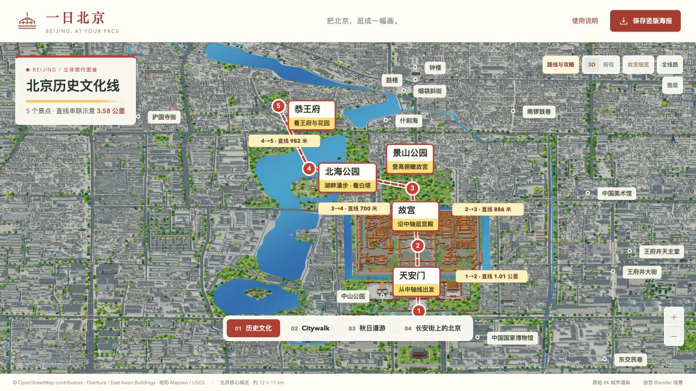

# 一日北京 · 3D 旅行地图



可旋转、缩放的北京核心城区旅游地图。用真实建筑轮廓呈现城市，在重点景点加载更精细的建筑模型，并把当天行程、交通方案和手机竖版海报放在同一张地图中。

**当前版本仍在持续完善建筑精度**：城市建筑多为地图轮廓挤出，部分高度、屋顶与立面为推定；重点地标含照片参考重建和 AI 生成资产，不是实景摄影测量或文保测绘模型。

## 功能

- 历史文化、City Walk、赏秋、跟着 1 号线游北京四条主题线路。
- 搜索百度地图地点、手动添加酒店／餐厅／集合点、保存当天行程。
- 实际步行和公交／地铁方案：距离、耗时、上车／下车站、换乘和步行接驳。
- “去下一站”打开百度地图；根据交通耗时和停留时间建议顺序。
- 重点建筑远近 LOD、城市体块、绿地与湖泊、竖版行程海报。

## 运行

需要 Python 3.12+、支持 WebGL 2 的桌面浏览器。运行网页无需安装 Blender 或 npm 依赖。

```bash
git clone https://github.com/zhengrui0207-png/beijing-3d-travel-map.git
cd beijing-3d-travel-map
python3 scripts/download_assets.py
python3 server.py --open
```

macOS 也可以双击 `启动北京地图.command`。初次启动会下载 Release 模型包，后续复用本地资源。打开 `http://127.0.0.1:5198/`。

源码与模型分开发行：Git 保存代码、清单、许可及轻量验证资料，Release 提供模型／贴图和可选的地理构建数据。下载脚本验证 SHA-256，校验通过后才解包。

## 配置百度出行

在页面右侧点击“连接服务”，输入自己的**服务端 AK**，开通地点检索和轻量级路线规划，使用 IP 白名单校验。AK 仅保存在当前用户的 `~/.config/beijing-atlas/baidu.json`（权限 0600），不会写进前端、海报或此仓库。也支持环境变量 `BAIDU_MAP_AK`。

**状态 210 = 公网出口 IP 未通过白名单。** 家庭宽带、热点、代理出口可能变化。点击“检测百度连接与公网 IP”，到百度控制台更新为服务器当前的公网出口 IP 后重新加载方案。填写 `localhost`、`127.0.0.1` 或内网 IP 不能通过百度服务端校验。公网 IP 检测服务与百度请求可能因代理分流使用不同出口，应核对实际网络配置。

百度请求默认直接联网，避免自动继承系统代理后频繁变化出口。如果服务器必须使用代理，可显式设置 `BAIDU_USE_SYSTEM_PROXY=1`，并将代理公网出口加入白名单。SN 签名型 AK 暂不支持。

地图浏览和本地行程不要求配置 AK；道路方案与在线地点搜索需要有效 AK、服务权限及可用配额。百度出行服务的授权和配额由使用者自行配置。

## 在线 Demo

[打开北京 3D 旅行地图](https://airesumejob.xyz/beijing-map/)

线上使用独立、只读的出行 API；游客可查询地点和方案，不能修改服务端密钥。

## GitHub 与在线部署

本仓库支持**本机运行**，并提供 `hosted_server.py` 与 `deploy/` 中的线上部署配置，Python 服务默认只监听本机，并保留 Host、Origin 与会话令牌校验。GitHub Pages 只能运行静态页面，不能执行这里的 Python 百度接口；不要把服务端 AK 放进 Pages。

若部署为多人访问网站，需要另行部署带固定出口 IP 的后端、HTTPS、访问与限流控制，并按部署域名配置前后端。线上入口只开放 status/search/route；配置、诊断接口不对公众开放。参考 [部署说明](deploy/README.md)。

## 开发与验证

```bash
python3 -m unittest discover -s tests -p test_travel_api.py
node --test tests/route-core.test.mjs tests/travel-core.test.mjs tests/route-poster.test.mjs
```

完整几何验证需先运行 `python3 scripts/download_assets.py --with-data` 下载模型和可选构建数据，再运行 `node --test tests/*.test.mjs`。`scripts/` 中的 Blender 脚本用于重建具体资产；部分早期生成脚本需要相应数据工具、外部生成服务或 Blender 插件，运行现成地图不需要这些服务。

目录：`public/` 前端与资产清单，`server.py` 本机 HTTP 服务，`travel_api.py` 百度服务端适配，`scripts/` 建筑生成与验证，`data/` 地理和建模参数，`tests/` 测试。

## 许可和署名

原创代码使用 MIT。OpenStreetMap／Overture 数据、第三方模型和照片**各自保留原许可**，不因代码开源而变成 MIT。详见 [THIRD_PARTY_NOTICES.md](THIRD_PARTY_NOTICES.md) 和各资产目录中的署名文件。路线仅作为旅行规划辅助，开放时间、预约和通行入口请以景点与导航服务当日信息为准。
